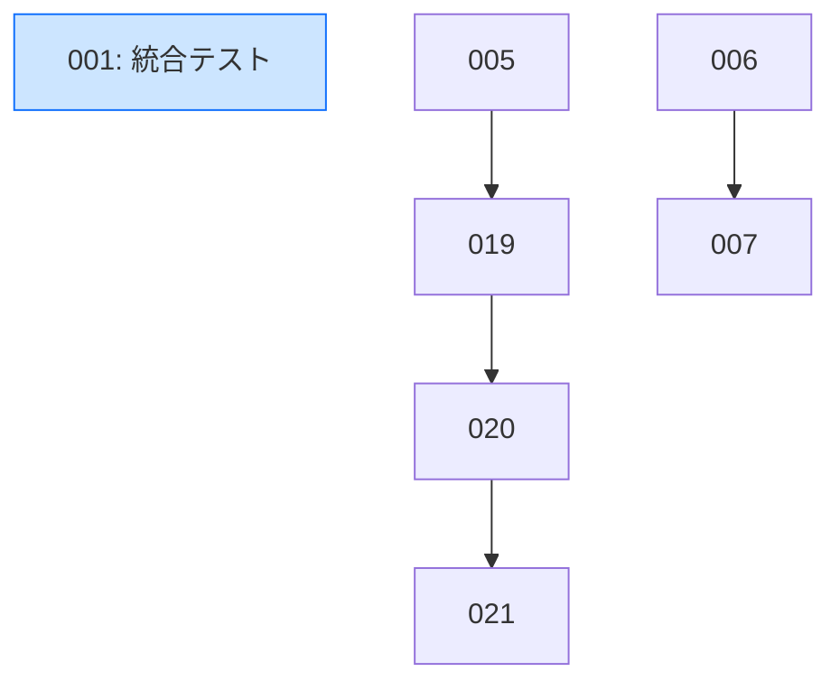

# ADR Execution Harness

## Context

27件のADRを効率的に消化するためのツール群を整備する。現状は全て手動管理（Markdown + git）で、状態一覧・依存関係・セッション引き継ぎの仕組みがない。

ユーザー提案: **ADRにfrontmatterを導入**し、機械処理しやすくする。

## 方針

### frontmatter 導入

既存ADRの `## ステータス` セクションの内容を YAML frontmatter に構造化する。本文の `## ステータス` セクションは廃止し、frontmatter が single source of truth となる。

**frontmatter スキーマ:**

```yaml
---
status: Accepted # Proposed | Accepted | InProgress | Complete
deps: [5, 6, 7] # 前提(blocking)ADR番号（空なら省略）
plan: plan-xxx.md # docs/plans/ 内のファイル名（なければ省略）
substatus: # サブステータス（なければ省略）
  html: Complete
  canvas: InProgress
---
```

- `status`: 正規化済み全体ステータス。サブステータスがある場合は最も進んでいないもの
- `deps`: 前提(blocking)ADR番号のみ。単なる参考/関連は含めない。マイグレーション時に手動精査
- `plan`: Plan ファイル名（パスではなくファイル名のみ、`docs/plans/` 固定）
- `substatus`: ADR-015 のようにレンダラー別で進捗が異なる場合のみ使用

**本文側の変更:**

- `## ステータス` セクション → 削除（frontmatter に移行）
- `実装計画: [Plan](...)` → frontmatter の `plan` フィールドに移行
- `関連 ADR: [...]` → frontmatter の `deps` に移行（手動精査: blocking のみ選別）
- 自由テキストの qualifier（例: `(Phase 1 完了 — Phase 2 以降は ADR-006 に移管)`）→ 情報を失わないよう、移行先の ADR 本文に note として残す

### ツール構成

```
scripts/
  adr-status.ts        # トリアージ: 全ADRの状態一覧
  adr-deps.ts          # 依存マップ: Mermaid図 + 次アクション一覧
  adr-migrate-fm.ts    # 一回限り: 既存ADRにfrontmatter追加
  lib/
    adr-parser.ts      # 共有: frontmatter パース + ADR情報抽出
    types.ts           # 共有: 型定義

.claude/skills/
  adr-session.md       # セッション開始/再開スキル
```

## 実装計画

### Step 1: 型定義 (`scripts/lib/types.ts`)

```typescript
type AdrStatus = 'Proposed' | 'Accepted' | 'InProgress' | 'Complete';

interface AdrSubstatus {
  [key: string]: AdrStatus; // e.g. { html: 'Complete', canvas: 'InProgress' }
}

interface AdrFrontmatter {
  status: AdrStatus;
  deps?: number[];
  plan?: string;
  substatus?: AdrSubstatus;
}

interface AdrInfo {
  number: number;
  slug: string;
  title: string;
  frontmatter: AdrFrontmatter;
  filePath: string; // repo root からの相対パス
  planExists: boolean; // plan ファイルが実在するか
  planValidated: boolean; // <!-- validated --> マーカーがあるか
  bodyRefs: number[]; // 本文中の ADR-NNN 参照（情報提供用、deps とは別）
}

type AdrPhase = 'investigation' | 'planning' | 'validation' | 'implementation' | 'done';
```

### Step 2: パーサー (`scripts/lib/adr-parser.ts`)

- `parseFrontmatter(content: string): AdrFrontmatter` — `---` で囲まれた YAML を簡易パース
- `parseAdrFile(filePath: string, repoRoot: string): AdrInfo` — ファイル読み込み → frontmatter + タイトル + 本文参照抽出
- `parseAllAdrs(repoRoot: string): AdrInfo[]` — `docs/decisions/adr-*.md` を一括パース
- `getPhase(adr: AdrInfo): AdrPhase` — ステータス・Plan有無・validated有無からフェーズ判定
- `getActionableAdrs(adrs: AdrInfo[]): AdrInfo[]` — deps が全て Complete のもの

**frontmatter パーサーの実装方針:**

- 正規表現で `---` 〜 `---` を抽出
- `status:`, `deps:`, `plan:`, `substatus:` の4キーに対応（汎用YAMLパーサー不要）
- `deps: [1, 2, 3]` は `/\[([^\]]*)\]/` で中身を取り、カンマ分割 → parseInt
- `substatus:` はインデント付きの `key: value` ペアを次の非インデント行まで収集

### Step 3: マイグレーションスクリプト (`scripts/adr-migrate-fm.ts`)

既存27件のADRを一括変換。**2段階のワークフロー**で安全に実行する。

**Phase A: 自動推定 + dry-run プレビュー**

1. `## ステータス` セクションからフィールドを抽出:
   - status: キーワード優先順位で推定
     - `Complete` / `Done` / `実装完了` → `Complete`
     - `In Progress` → `InProgress`
     - `Accepted` → `Accepted`
     - `Proposed` → `Proposed`
   - deps: `関連 ADR:` 行から `ADR-(\d{3})` パターンで抽出
   - plan: `実装計画:` 行から `plan-*.md` ファイル名を抽出
   - substatus: ADR-015 のような複数行ステータスを検出
2. frontmatter を生成して先頭に挿入
3. `## ステータス` セクション（次の `##` まで）を削除
4. qualifier 情報（`(Phase 1 完了...)` 等）がある場合、本文の `## コンテキスト` 冒頭に note として挿入

実行: `node scripts/adr-migrate-fm.ts --dry-run` → 各ADRの変換差分を出力

**Phase B: 手動精査 + 実書き込み**

dry-run 出力を確認し、特に以下を精査:

- `deps` が本当に blocking dependency か（相互参照は片方を外す等）
- `status` の推定が正しいか（`Accepted (実装完了)` → `Complete` の判定）
- `substatus` が必要なADR（現状 ADR-015 のみ想定）

精査後: `node scripts/adr-migrate-fm.ts --write`

**ロールバック:** git 管理下なので `git checkout -- docs/decisions/` で元に戻せる

**TEMPLATEも更新:**

```yaml
---
status: Proposed
---
# ADR-NNN: {タイトル}

## コンテキスト
...
```

### Step 4: トリアージスクリプト (`scripts/adr-status.ts`)

`pnpm adr:status` で実行。出力例:

```
# ADR Status (2026-02-16)

| #   | Title                        | Status   | Plan       | Phase          |
| --- | ---------------------------- | -------- | ---------- | -------------- |
| 001 | 統合テスト                   | Accepted | exists     | implementation |
| 002 | 範囲レンダリング修正         | Complete | exists     | done           |
| 010 | Kaeri Unicode正規化          | Proposed | -          | investigation  |
| 024 | Validator複雑度削減          | Accepted | -          | planning       |

Summary: Complete=4, Accepted=19, InProgress=2, Proposed=2
```

オプション:

- `--output <path>`: ファイルにも出力（デフォルト stdout のみ）
- `--actionable`: next actionable のみ表示

### Step 5: 依存マップスクリプト (`scripts/adr-deps.ts`)

`pnpm adr:deps` で実行。2つの出力:

**1. Mermaid ダイアグラム:**



**2. Next actionable リスト:**
deps が全て Complete のADR（= 今すぐ着手可能）を一覧表示。

### Step 6: adr-session スキル (`.claude/skills/adr-session.md`)

トリガー: `/adr-session [ADR番号]`

**ADR番号指定時:**

1. `node scripts/adr-status.ts` でステータス表示
2. 対象ADRファイルを読み込んで要約
3. deps の完了状況チェック（未完了の前提ADRがあれば警告）
4. フェーズに応じたガイダンス:
   - investigation: 「調査セッション。コンテキストを理解し、必要ならADRをAcceptに更新」
   - planning: 「Plan作成セッション。Plan Modeを使用」
   - validation: 「Plan検証セッション。logic-validatorで検証」
   - implementation: 「実装セッション。Planに従って実装」
5. `.tmp/session-memos/` で関連メモを検索して表示

**ADR番号なし:**

1. ステータス表示
2. next actionable リスト表示
3. 推奨ADRを提案（依存が少ない独立ADRを優先）

**セッション終了リマインド:**
スキル内で「セッション終了時は `/session-memo` でメモを残すこと」をガイダンスに含める

### Step 7: package.json / knip 更新

**package.json** に追加:

```json
"adr:status": "node scripts/adr-status.ts",
"adr:deps": "node scripts/adr-deps.ts"
```

**knip.config.ts** の `'.'` ワークスペースを更新:

```typescript
'.': {
  entry: ['scripts/adr-status.ts', 'scripts/adr-deps.ts'],
  project: ['scripts/**/*.ts'],
  vitest: false,
},
```

## 対象ファイル

**新規作成:**

- `scripts/lib/types.ts`
- `scripts/lib/adr-parser.ts`
- `scripts/adr-status.ts`
- `scripts/adr-deps.ts`
- `scripts/adr-migrate-fm.ts`
- `.claude/skills/adr-session.md`

**編集:**

- `package.json` — スクリプト追加
- `knip.config.ts` — scripts/ エントリ追加
- `docs/decisions/TEMPLATE.md` — frontmatter形式に更新
- `docs/decisions/adr-*.md` × 27 — マイグレーション（スクリプトで一括）

## 実装順序

1. types.ts + adr-parser.ts（コアライブラリ）
2. adr-migrate-fm.ts（マイグレーション。dry-run で確認後に実行）
3. 既存ADR 27件のマイグレーション実行 + TEMPLATE更新
4. adr-status.ts + package.json スクリプト追加
5. adr-deps.ts + package.json スクリプト追加
6. adr-session.md スキル作成
7. knip.config.ts 更新

## 検証方法

1. `node scripts/adr-migrate-fm.ts --dry-run` で全ADRの変換プレビュー確認
2. マイグレーション後、`pnpm adr:status` が全27件を正しく表示
3. `pnpm adr:deps` が Mermaid 図と actionable リストを出力
4. `git diff` で各ADRの変換内容を手動レビュー
5. `/adr-session` と `/adr-session 019` の両方が正しく動作

<!-- validated -->
